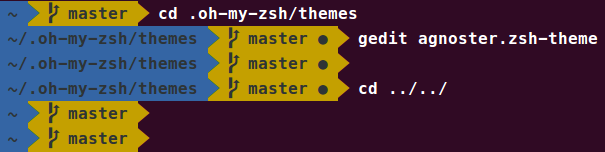

# Zsh環境設定
---
## Installation
- Zsh
- Oh-My-Zsh
- Powerline

### Install Zsh ＆ Oh-My-Zsh
安裝步驟

	# 更新apt的package目錄
	$ sudo apt-get update
	$ sudo apt-get upgrade

	# 安裝Zsh
    $ sudo apt install zsh
    $ sudo apt install git-core zsh
    
    # 使用官方腳本安裝Oh-My-Zsh
    $ sh -c "$(wget https://raw.githubusercontent.com/robbyrussell/oh-my-zsh/master/tools/install.sh -O -)"

### Install Oh-My-Zsh
安裝步驟

	# 安裝Powerline字體
    $ sudo apt-get install fonts-powerline
	# 執行下載powerline-fonts的設定
	# clone
	git clone https://github.com/powerline/fonts.git --depth=1
	# install
	cd fonts
	./install.sh
	# clean-up a bit
	cd ..
	rm -rf fonts
	
    # (安裝配置字體)
    # $ fc-cache -fv fonts)

### 設定Oh-My-Zsh主题
把主題從robbyrussell改為agnoster的Oh-My-Zsh主题
	
    $ gedit ~/.zshrc
    # 將ZSH_THEME="robbyrussell"改成"agnoster"

	# 執行修改檔案的命令
	$ source ~/.zshrc

簡化主題提示訊息(去掉用戶名和主機名)

	$ cd .oh-my-zsh/themes
	$ gedit agnoster.zsh-theme
	# 將prompt_context註解掉

將默認的shell改成Zsh 

	$ chsh -s $(which zsh)
    # 登出再登入查看結果

**問題解決**: 圖片或字型出現亂碼現象

	# 點選shell->點右鍵->設定檔->設定檔偏好設定
    # 找尋Powerline字體
	# 選取適當的字型樣式

## Resources
- [ohmyzsh](https://github.com/ohmyzsh/ohmyzsh)
- [Powerline fonts](https://github.com/powerline/fonts)
- [關於zsh的一些配置](https://blog.csdn.net/m765885195t/article/details/75353928)
- [最強Linux工具Oh-My-Zsh指南](https://www.twblogs.net/a/5b8e2ff52b717718834364c2/zh-cn)
- [在 Ubuntu 18.04 LTS / 16.04 LTS 中安裝使用 Oh-My-Zsh](https://medium.com/@wifferlin0505/%E5%9C%A8-ubuntu-16-04-lts-%E4%B8%AD%E5%AE%89%E8%A3%9D%E4%BD%BF%E7%94%A8-oh-my-zsh-cf92203ca8a2)

